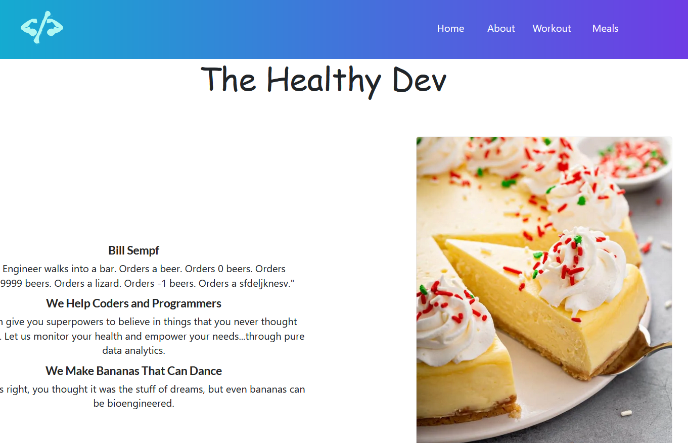
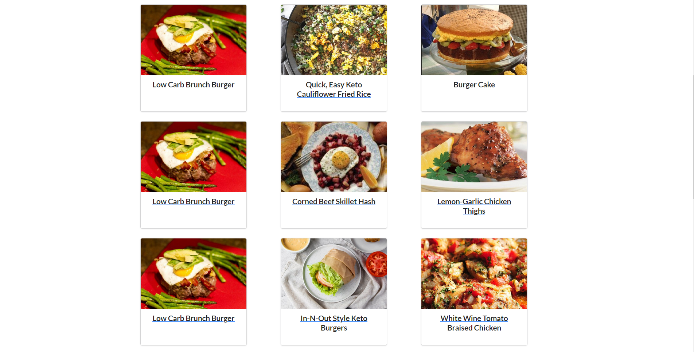

# The Healthy Dev

This project can be reached at [The Heathy Dev](https://thehealthydev.netlify.app).

## Description

A small project to monitor health and meal for programmers and coders, healthy life healthy code.

### Main Features

- Search form, React Hook Form
- Call API
- Return data and details page
- localStorage, set, get, remove data
- Redux, reducers

### Libraries and dependencies

- Material UI icon
- Semantic UI design
- Axios
- React Bootstrap, Bootstrap
- React Hook Form
- React Redux
- React Router Dom: 5.2
- Store.js

### Testing
 I have not tested it yet, but this is a field need to jot down

#### Thank you
#### Tony Nguyen
